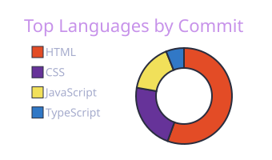
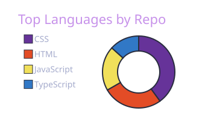

<div align="center">

<a href="https://git.io/typing-svg">
  
</a>

</div>

<br>

## 👋 Sobre mim

```javascript
const leoAntunes = {
    funcao: "Desenvolvedor Full Stack",
    stack: ["React", "TypeScript", "Node.js"],
    missao: "Construir interfaces funcionais, com ótimo design, código limpo e reutilizável."
};
```

<br>

## 💻 Tecnologias

<div align="center">

### 🎨 Front-end
[](https://skillicons.dev)

### ⚙️ Back-end
[](https://skillicons.dev)

</div>

<br>

```text
├── src/
│   ├── frontend/
│   │   ├── react/ ⚛️
│   │   ├── vite/ ⚡
│   │   ├── tailwind/ 🎨
│   │   ├── styled-components/ 💅
│   │   └── material ui/ 🖌️
│   ├── backend/
│   │   ├── node/ 🟢
│   │   ├── express/ 🚂
│   │   └── docker/ 🐳
│   ├── database/
│   │   ├── postgres/ 🐘
│   │   └── mongodb/ 🍃
│   └── core/
│       ├── javascript/ 🟨
│       └── typescript/ 🔷
└── README.md ✅ você está aqui
```

<br>

## 📊 GitHub Stats

<div align="center">
  
  [](https://git.io/streak-stats)

  

  
  
</div>

## 📈 Minha atividade

<div align="center">
  
</div>

<br>

## 📫 Vamos conversar?

<div align="center">

<a href="https://SEU_PORTFOLIO.com" target="_blank">
  
</a>
<a href='https://www.linkedin.com/in/leoantuness/' target="_blank" />
  
  </a>
<a href="mailto:leonardo_antunes_s@hotmail.com">
  </a>

</div>
